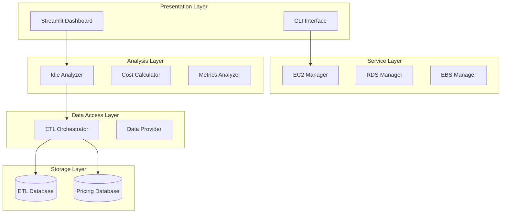
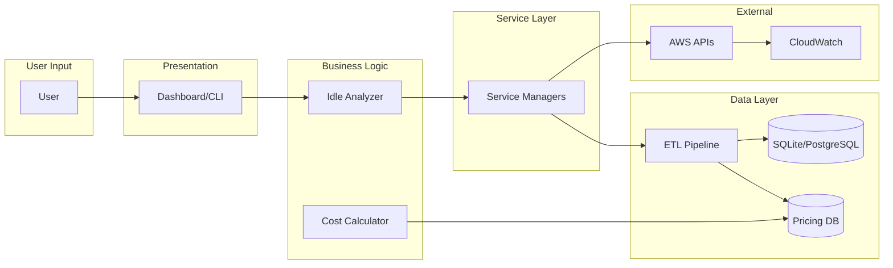
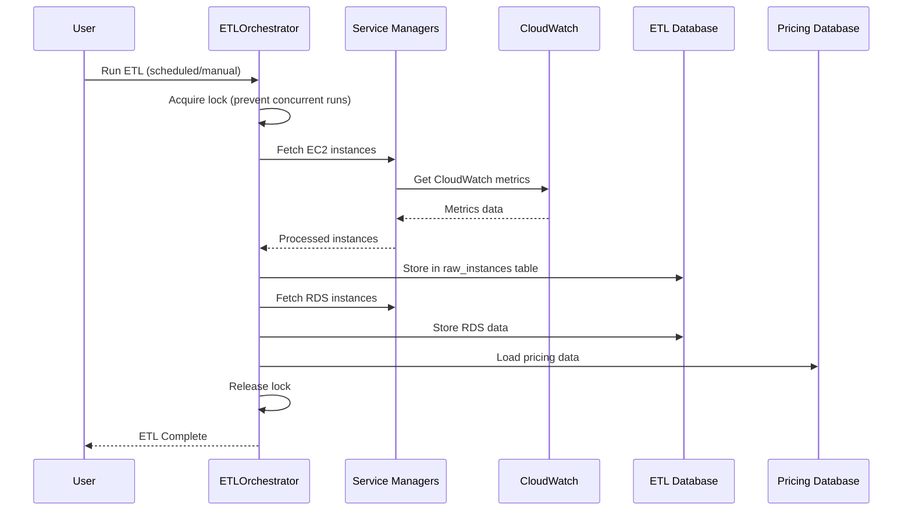

# AWS Idle Identifier - Comprehensive Architectural Blueprint

**Project:** AWS Cost Optimization Tool (aws-idle-identifier)  
**Version:** 1.0  
**Date:** 2026-03-12  
**Author:** Architectural Analysis

---

## 1. Executive Summary

The AWS Idle Identifier is a Python-based tool for monitoring and optimizing AWS resource costs. It analyzes EC2, RDS, and EBS resources to identify idle or underutilized instances and calculates potential cost savings. The application supports both a Streamlit-based web dashboard and a command-line interface, with multi-environment support for different AWS accounts.

---

## 2. Complete Directory Structure

```
aws-idle-identifier/
├── main.py                           # Application entry point (routes CLI/Dashboard)
├── requirements.txt                  # Python dependencies
├── setup.py                          # Package configuration
├── .env                              # Environment variables (credentials)
├── .env.example                      # Example environment configuration
├── .gitignore                        # Git ignore rules
├── Dockerfile                        # Docker image definition
├── docker-compose.yml                # Docker Compose orchestration
├── run.sh / run.ps1 / run.bat        # Platform-specific runners
├── unlock_etl.py                     # ETL lock management utility
│
├── core/                             # Core configuration and utilities
│   ├── __init__.py
│   ├── config.py                     # Centralized configuration management
│   ├── constants.py                  # Application-wide constants
│   └── logger.py                     # Logging infrastructure
│
├── services/                         # AWS service managers
│   ├── __init__.py
│   ├── base_manager.py               # Base class with boto3 integration
│   ├── ec2_manager.py                # EC2 instance operations
│   ├── rds_manager.py                # RDS database operations
│   ├── ebs_manager.py                # EBS volume operations
│   └── s3_manager.py                 # S3 bucket operations (deprecated)
│
├── analysis/                         # Analysis modules
│   ├── __init__.py
│   ├── idle_analyzer.py              # Idle resource detection logic
│   ├── cost_calculator.py            # Cost savings calculations
│   └── metrics_analyzer.py            # CloudWatch metrics analysis
│
├── etl/                              # ETL pipeline
│   ├── __init__.py
│   ├── orchestrator.py               # ETL orchestration and scheduling
│   ├── data_provider.py              # Database data access layer
│   ├── pricing_loader.py             # AWS pricing data loader
│   ├── ebs_pricing_loader.py         # EBS pricing ETL
│   ├── rds_storage_pricing_loader.py # RDS storage pricing ETL
│   ├── rds_database_engine_pricing_loader.py
│   ├── reserved_instance_pricing_loader.py
│   ├── scheduler.py                  # ETL scheduling
│   └── base_db.py                    # Base database operations
│
├── database/                         # Database layer
│   ├── __init__.py
│   ├── client.py                     # SQLAlchemy engine/session management
│   ├── models.py                     # ORM models (RawInstance, EtlRun, etc.)
│   ├── db_utils.py                   # Database utilities
│   ├── README.md                     # Database documentation
│   │
│   ├── ddl/                          # DDL for multiple databases
│   │   ├── __init__.py
│   │   ├── base.py                    # Base DDL template
│   │   ├── factory.py                # DDL factory
│   │   ├── postgres.py               # PostgreSQL DDL
│   │   ├── mysql.py                  # MySQL DDL
│   │   ├── mssql.py                  # MSSQL DDL
│   │   ├── oracle.py                 # Oracle DDL
│   │   └── sqlite.py                 # SQLite DDL
│   │
│   ├── init/                         # Database initialization
│   │   └── 01-init.sql              # Initial SQL schema
│   │
│   └── migrations/                   # Database migrations
│       └── migrate.py               # Migration runner
│
├── ui/                               # User interfaces
│   ├── __init__.py
│   ├── dashboard.py                  # Streamlit dashboard (145KB)
│   ├── cli.py                        # CLI interface
│   ├── charts.py                     # Chart components
│   ├── styles.css                    # Dashboard styling
│   │
│   └── dashboard/                    # Dashboard components
│       ├── __init__.py
│       ├── components.py              # Reusable UI components
│       ├── helpers.py                # Dashboard helpers
│       ├── views_single_analysis.py  # Single resource analysis view
│       └── cache.py                   # Dashboard caching
│
├── utils/                            # Utility modules
│   ├── __init__.py
│   ├── alerting.py                   # Alerting system
│   ├── auth.py                       # Authentication/authorization
│   ├── rate_limiter.py               # AWS API rate limiting
│   └── validators.py                # Input validation
│
├── tests/                            # Test suite
│   ├── test_cost_calculator.py
│   ├── test_etl_integration.py
│   ├── test_etl_run.py
│   ├── test_validators.py
│   └── db/
│       └── etl_database.db
│
├── data/                             # Data storage
│   ├── etl_database.db              # ETL data (SQLite)
│   └── pricing_database.db           # Pricing data (SQLite)
│
├── logs/                             # Application logs
│   ├── aws_monitor.log
│   ├── aws_monitor.log.1-5           # Rotated logs
│
├── plans/                            # Planning documents
│   ├── ARCHITECTURE_OVERVIEW.md
│   ├── AWS_COST_CALCULATION_PARAMETERS.md
│   ├── authentication-plan.md
│   ├── cost_breakdown_plan.md
│   ├── COMPREHENSIVE_CODE_REVIEW_REPORT.md
│   ├── COMPREHENSIVE_PERFORMANCE_PLAN.md
│   ├── PLUGGABLE_SERVICES_ARCHITECTURE.md
│   └── multi-region-support-plan.md
│
├── docs/                             # Documentation
│   └── IDLE_INSTANCE_COST_CALCULATION.md
│
├── dumps/                            # Data dumps
│   ├── prc.py
│   └── SQL_SERVER_TO_POSTGRESQL_MIGRATION_BLUEPRINT.md
│
└── aws_cost_optimization.egg-info/   # Package metadata
    ├── PKG-INFO
    ├── SOURCES.txt
    ├── requires.txt
    └── top_level.txt
```

---

## 3. Technology Stack

### 3.1 Programming Language
- **Python 3.9+** (Docker uses Python 3.11-slim)

### 3.2 Core Frameworks
| Framework | Version | Purpose |
|-----------|---------|---------|
| boto3 | >=1.34.0 | AWS SDK for Python |
| streamlit | >=1.30.0 | Web dashboard UI |
| plotly | >=5.18.0 | Interactive charts |
| sqlalchemy | >=2.0.0 | ORM and database abstraction |
| pandas | >=2.1.0 | Data manipulation |
| apscheduler | >=3.10.4 | Task scheduling |

### 3.3 Database Drivers
| Database | Driver | Async Driver |
|----------|--------|---------------|
| SQLite | aiosqlite | 0.19.0 |
| PostgreSQL | psycopg2-binary | asyncpg |
| MySQL | pymysql | aiomysql |
| Oracle | oracledb | - |
| MSSQL | pyodbc | - |

### 3.4 Security Libraries
- bcrypt >=4.0.0 (password hashing)
- python-dotenv >=1.0.0 (environment variables)

### 3.5 Development/Tools
- colorama >=0.4.6 (CLI colors)
- requests >=2.31.0 (HTTP requests)
- bandit >=1.7.6 (security linting)
- safety >=3.0.0 (dependency scanning)

---

## 4. Architecture Patterns

### 4.1 Layered Architecture



### 4.2 Design Patterns Employed

| Pattern | Implementation | Purpose |
|---------|----------------|---------|
| **Singleton** | Config class, cached pricing loaders | Single source of configuration |
| **Factory** | Database DDL factory, service managers | Create database-specific objects |
| **Template Method** | BaseServiceManager, BaseDatabase | Define skeleton algorithms |
| **Repository** | ETLDataProvider | Abstract data access |
| **Strategy** | Dual-mode (ETL vs Direct API) | Interchangeable data sources |
| **Decorator** | @profile_performance | Add profiling without modifying code |

### 4.3 Key Design Principles

1. **Dual-Mode Operation**: Services can operate in ETL mode (database-backed) or Direct API mode (real-time AWS calls)
2. **Multi-Database Support**: Abstracted database layer supporting PostgreSQL, MySQL, Oracle, MSSQL, SQLite
3. **Multi-Environment Support**: Separate AWS credentials for Default, Green, and Red environments
4. **Configuration-Driven**: All thresholds, limits, and settings in constants.py and config.py
5. **Connection Pooling**: Both ETL and pricing databases use SQLAlchemy connection pooling

---

## 5. Component Interaction

### 5.1 Data Flow Diagram



### 5.2 ETL Pipeline Flow



### 5.3 Key Module Interactions

| Interaction | Description |
|-------------|-------------|
| `main.py` → `ui/cli.py` | Routes to CLI when arguments provided |
| `main.py` → `ui/dashboard.py` | Routes to Streamlit when no args |
| `ui/cli.py` → `services/*` | Direct API mode for CLI |
| `ui/dashboard.py` → `etl/data_provider.py` | ETL mode for dashboard |
| `services/base_manager.py` → `boto3` | AWS API calls |
| `analysis/idle_analyzer.py` → `etl/data_provider.py` | Gets activity data |
| `analysis/cost_calculator.py` → `pricing_database.db` | Gets pricing info |

---

## 6. AWS Services Utilized

### 6.1 Service Summary

| AWS Service | API Operations | Purpose |
|-------------|---------------|---------|
| **EC2** | DescribeInstances, DescribeRegions | List EC2 instances |
| **RDS** | DescribeDBInstances, ListTagsForResource | List RDS databases |
| **EBS** | DescribeVolumes | List EBS volumes |
| **CloudWatch** | GetMetricStatistics, ListMetrics | Fetch performance metrics |
| **Pricing** | GetProducts | Fetch AWS pricing data |

### 6.2 IAM Permissions Required

```json
{
  "Version": "2012-10-17",
  "Statement": [
    {
      "Effect": "Allow",
      "Action": [
        "ec2:Describe*",
        "rds:Describe*",
        "rds:ListTagsForResource",
        "cloudwatch:GetMetricStatistics",
        "cloudwatch:ListMetrics",
        "s3:ListAllMyBuckets",
        "s3:GetBucket*",
        "pricing:GetProducts"
      ],
      "Resource": "*"
    }
  ]
}
```

### 6.3 Multi-Environment Support

The application supports three AWS environments:
- **Default**: Primary AWS account (AWS_ACCESS_KEY_ID, AWS_SECRET_ACCESS_KEY)
- **Green**: Secondary environment (AWS_GREEN_*)
- **Red**: Tertiary environment (AWS_RED_*)

---

## 7. Database Schema

### 7.1 Core Tables

#### Table: `etl_runs`
| Column | Type | Description |
|--------|------|-------------|
| run_id | Integer | Primary key |
| run_type | String | Type of ETL run |
| status | String | running/completed/failed |
| start_time | DateTime | Run start timestamp |
| end_time | DateTime | Run completion timestamp |
| duration_seconds | Integer | Duration in seconds |
| records_extracted | Integer | Records fetched |
| records_loaded | Integer | Records stored |
| error_message | Text | Error details |
| triggered_by | String | Manual/scheduled |
| service_flags | String | Which services processed |

#### Table: `raw_instances`
| Column | Type | Description |
|--------|------|-------------|
| instance_id | String | Primary key (resource ID) |
| service_type | String | EC2/RDS/EBS |
| region | String | AWS region |
| instance_class | String | Instance type |
| status | String | Resource state |
| created_date | DateTime | Creation timestamp |
| vpc_id | String | VPC ID |
| environment_tag | String | Environment tag |
| allocated_storage | Integer | Storage size (GB) |
| storage_type | String | gp2/gp3/io1/etc |
| multi_az | Boolean | Multi-AZ enabled |
| monthly_cost | Float | Calculated cost |
| raw_data | Text | JSON raw data |
| extracted_at | DateTime | Last ETL timestamp |

#### Table: `raw_metrics`
| Column | Type | Description |
|--------|------|-------------|
| metric_id | Integer | Primary key |
| instance_id | String | Foreign key |
| metric_name | String | CPUUtilization/IOPS/etc |
| metric_value | Float | Metric value |
| timestamp | DateTime | Measurement time |

#### Table: `instance_tags`
| Column | Type | Description |
|--------|------|-------------|
| tag_id | Integer | Primary key |
| instance_id | String | Foreign key |
| tag_key | String | Tag name |
| tag_value | String | Tag value |

### 7.2 Storage Mechanisms

- **SQLite** (default): File-based for development
- **PostgreSQL** (production): Connection pooling with pool_size=5, max_overflow=10
- **Separate pricing database**: Isolated from ETL to prevent data loss during truncate operations

---

## 8. API Endpoints and Specifications

### 8.1 CLI Commands

```bash
# Check all RDS instances
python main.py --service rds --check-all

# Check specific EC2 instance
python main.py --service ec2 --instance-id i-1234567890abcdef0

# Analyze S3 buckets
python main.py --service s3 --analyze

# Run ETL
python -m etl.orchestrator

# Unlock ETL
python main.py --unlock
```

### 8.2 CLI Arguments

| Argument | Type | Description | Default |
|----------|------|-------------|---------|
| --service | string | rds/ec2 | Required |
| --check-all | flag | Check all instances | false |
| --instance-id | string | Specific instance | None |
| --region | string | AWS region | us-east-1 |
| --cloudwatch-hours | int | Metrics hours | 24 |
| --activity-days | int | Activity threshold days | 30 |
| --idle-threshold | int | Idle threshold % | 50 |
| --output | string | Output file | stdout |
| --csv | string | CSV output file | None |

### 8.3 Dashboard Routes

- **Main Dashboard**: http://localhost:8501
- **Single Analysis**: `/single-analysis` view
- **pgAdmin** (Docker): http://localhost:5050

---

## 9. Security Implementation

### 9.1 Authentication

```python
# utils/auth.py
class AuthManager:
    # Features:
    - Multiple admin users from ADMIN_USERS env var
    - Bcrypt password hashing
    - Session management with configurable timeout
    - Password change functionality
```

### 9.2 Configuration

- **ADMIN_USERS**: Comma-separated `username:hash` pairs
- **SESSION_TIMEOUT_MINUTES**: Session inactivity timeout (default: 10)
- Credentials stored in `.env` file (not committed to version control)

### 9.3 Security Best Practices Implemented

- Non-root user in Docker container
- Environment variable-based credentials
- Least-privilege IAM permissions documented
- Rate limiting on AWS API calls (100 calls/60 seconds)

---

## 10. Infrastructure as Code

### 10.1 Docker Configuration

**Dockerfile Highlights:**
```dockerfile
FROM python:3.11-slim
WORKDIR /app
RUN useradd --create-home --shell /bin/bash appuser
USER appuser
EXPOSE 8501
HEALTHCHECK --interval=30s --timeout=10s --start-period=5s --retries=3
ENTRYPOINT ["streamlit", "run", "main.py"]
```

### 10.2 Docker Compose Services

| Service | Image | Ports | Purpose |
|---------|-------|-------|---------|
| postgres | postgres:15-alpine | 5435:5432 | PostgreSQL database |
| streamlit-app | Custom build | 8501:8501 | Application |

### 10.3 Environment Variables

| Variable | Description | Default |
|----------|-------------|---------|
| DATABASE_URL | SQLAlchemy connection | sqlite:// |
| AWS_ACCESS_KEY_ID | AWS credentials | - |
| AWS_SECRET_ACCESS_KEY | AWS secret | - |
| AWS_DEFAULT_REGION | AWS region | us-east-1 |
| POSTGRES_USER | DB user | costadmin |
| POSTGRES_PASSWORD | DB password | costpassword |
| POSTGRES_DB | Database name | cost_optimization |

---

## 11. Performance Optimization Strategies

### 11.1 Implemented Optimizations

| Strategy | Implementation |
|----------|----------------|
| **Connection Pooling** | SQLAlchemy pool_size=5, max_overflow=10 |
| **Caching** | TTLCache for pricing data (30s TTL) |
| **Batch Processing** | METRIC_DATA_QUERY_BATCH_SIZE=100 |
| **Lazy Loading** | ETL provider created on demand |
| **Concurrency** | MAX_CONCURRENT_WORKERS=10 |
| **Rate Limiting** | 100 calls per 60 seconds |
| **Async Database** | aiosqlite, asyncpg support |

### 11.2 Idle Detection Thresholds

| Metric | Threshold |
|--------|-----------|
| CPU Utilization | < 5% |
| Database Connections | < 1 |
| Read IOPS | < 1 |
| Write IOPS | < 1 |
| Network Throughput | < 1000 bytes/sec |
| Disk Read/Write | < 1000 bytes/sec |

---

## 12. Recommendations for Improvement

### 12.1 High Priority

| Issue | Recommendation | Benefit |
|-------|----------------|---------|
| No CI/CD pipeline | Add GitHub Actions for automated testing and deployment | Reliability, faster releases |
| Hardcoded secrets | Implement AWS Secrets Manager or HashiCorp Vault | Better security |
| No monitoring | Add Prometheus + Grafana | Production readiness |
| Manual ETL triggers | Implement CloudWatch Events for scheduling | Automation |

### 12.2 Medium Priority

| Issue | Recommendation | Benefit |
|-------|----------------|---------|
| Single-region focus | Implement multi-region aggregation | Complete visibility |
| Limited S3 support | Restore and enhance S3 analysis | Broader coverage |
| No alerting integration | Add SNS/PagerDuty integration | Real-time notifications |
| Basic auth | Implement OAuth2/JWT | Enterprise SSO |

### 12.3 Modern Tech Stack Alternatives

| Current | Recommended Alternative | Reason |
|---------|------------------------|--------|
| Streamlit | React + FastAPI | More customization, better performance |
| SQLite | PostgreSQL (Aurora) | Production-grade, scaling |
| boto3 | aws-cdk / Terraform | Infrastructure as code |
| Custom scheduling | Apache Airflow | Enterprise scheduling |
| Python 3.11 | Python 3.12+ | Performance improvements |
| Custom auth | Auth0 / Cognito | Managed identity |

### 12.4 Architecture Improvements

1. **Microservices Architecture**: Split into separate services (ETL, API, UI)
2. **Event-Driven Design**: Use SQS/SNS for async processing
3. **GraphQL API**: Replace REST with GraphQL for flexible queries
4. **Edge Caching**: CloudFront for dashboard assets
5. **Serverless Components**: Lambda for ETL processing

---

## 13. Appendix: Key Constants

```python
# core/constants.py
HOURS_PER_MONTH = 730
LOCK_TIMEOUT_MINUTES = 60
MAX_CONCURRENT_WORKERS = 10
CLOUDWATCH_TIMEOUT_SECONDS = 60
PRICING_BATCH_SIZE = 10000
METRIC_DATA_QUERY_BATCH_SIZE = 100
CPU_IDLE_THRESHOLD = 5.0
CPU_CRITICAL_THRESHOLD = 1.0
DB_CONNECTIONS_IDLE_THRESHOLD = 1.0
PRICING_CACHE_TTL_SECONDS = 3600
INSTANCE_LIST_CACHE_TTL_SECONDS = 60
```

---

## 14. Quick Reference for Developers

### Starting the Application

```bash
# Local development
streamlit run main.py

# CLI mode
python main.py --service rds --check-all

# Docker
docker-compose up -d

# ETL pipeline
python -m etl.orchestrator
```

### Key Files Reference

| File | Purpose |
|------|---------|
| [`main.py`](main.py:1) | Entry point |
| [`core/config.py`](core/config.py:1) | Configuration |
| [`services/base_manager.py`](services/base_manager.py:1) | AWS API base |
| [`etl/orchestrator.py`](etl/orchestrator.py:1) | ETL pipeline |
| [`analysis/idle_analyzer.py`](analysis/idle_analyzer.py:1) | Idle detection |
| [`analysis/cost_calculator.py`](analysis/cost_calculator.py:1) | Cost calculations |
| [`ui/dashboard.py`](ui/dashboard.py:1) | Streamlit UI |
| [`ui/cli.py`](ui/cli.py:1) | CLI interface |

---

*This document serves as the primary reference for understanding the AWS Idle Identifier architecture. For specific implementation details, refer to the inline code documentation.*
