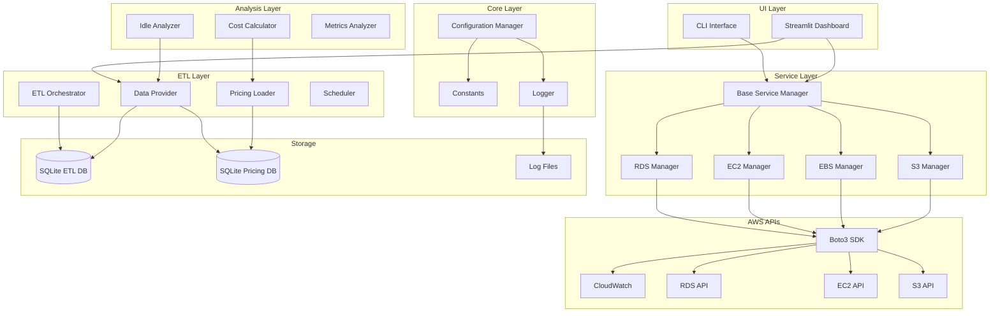
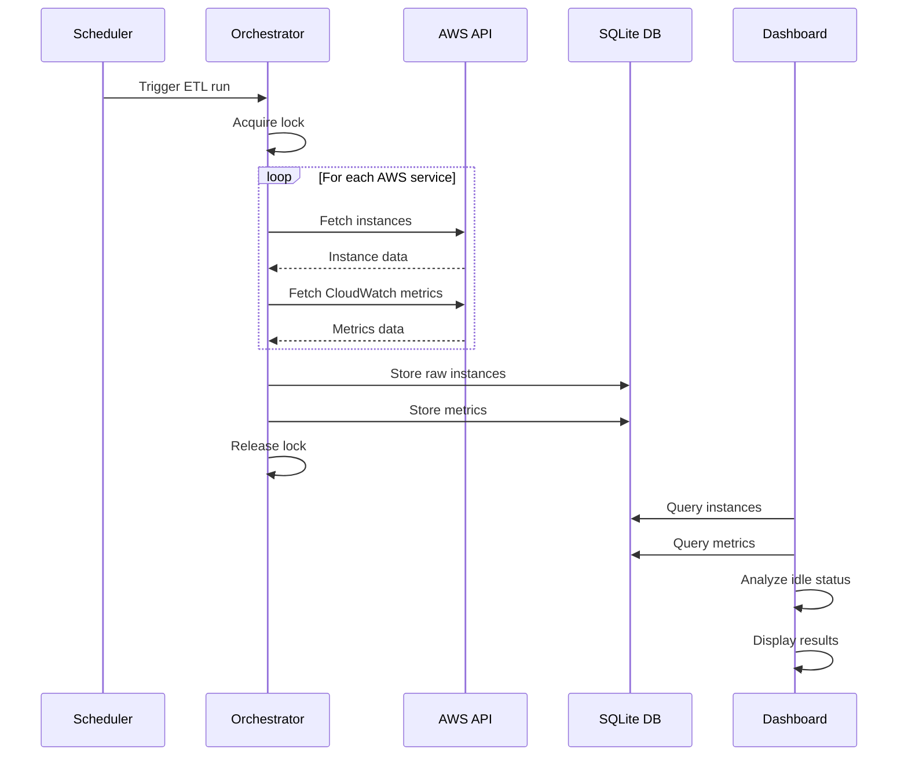
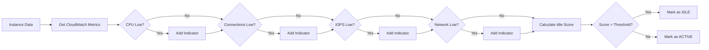

# AWS Cost Optimizer - Architecture Overview

## Project Summary

This is a **Python-based AWS Cost Optimization Tool** that helps identify idle and underutilized AWS resources to reduce cloud costs. It supports multiple AWS services including RDS, EC2, EBS, and S3.

---

## High-Level Architecture



---

## Directory Structure

```
COST-OPTIMISATION-AWS/
|-- main.py                    # Entry point - routes to CLI or Dashboard
|-- requirements.txt           # Python dependencies
|-- .env                       # Environment variables (credentials)
|-- .env.example               # Example environment config
|-- 
|-- core/                      # Core infrastructure
|   |-- __init__.py
|   |-- config.py              # Configuration management
|   |-- constants.py           # Magic numbers and thresholds
|   |-- logger.py              # Logging setup
|
|-- etl/                       # ETL Pipeline
|   |-- __init__.py
|   |-- orchestrator.py        # Main ETL orchestration
|   |-- data_provider.py       # Database query interface
|   |-- pricing_loader.py      # AWS pricing data loader
|   |-- ebs_pricing_loader.py  # EBS-specific pricing
|   |-- scheduler.py           # Scheduled ETL runs
|
|-- services/                  # AWS Service Managers
|   |-- __init__.py
|   |-- base_manager.py        # Base class with dual-mode support
|   |-- rds_manager.py         # RDS-specific operations
|   |-- ec2_manager.py         # EC2-specific operations
|   |-- ebs_manager.py         # EBS-specific operations
|   |-- s3_manager.py          # S3-specific operations
|
|-- analysis/                  # Analysis modules
|   |-- __init__.py
|   |-- idle_analyzer.py       # Idle resource detection
|   |-- cost_calculator.py     # Cost savings calculations
|   |-- metrics_analyzer.py    # CloudWatch metrics analysis
|
|-- ui/                        # User Interface
|   |-- __init__.py
|   |-- cli.py                 # Command-line interface
|   |-- dashboard.py           # Streamlit web dashboard
|   |-- charts.py              # Plotly chart generators
|
|-- utils/                     # Utilities
|   |-- __init__.py
|   |-- alerting.py            # Alert system
|   |-- rate_limiter.py        # AWS API rate limiting
|   |-- validators.py          # Input validation
|
|-- tests/                     # Test suite
|   |-- test_cost_calculator.py
|   |-- test_etl_integration.py
|   |-- test_etl_run.py
|   |-- test_validators.py
|
|-- logs/                      # Application logs
|   |-- aws_monitor.log
|
|-- dumps/                     # Documentation and archives
|   |-- plans/                 # Planning documents
|   |-- *.md                   # Various documentation
```

---

## Key Components

### 1. Entry Point ([`main.py`](main.py))

The application supports two modes:
- **CLI Mode**: `python main.py --service rds --check-all`
- **Dashboard Mode**: `streamlit run main.py`

Mode detection is automatic based on command-line arguments.

### 2. Core Layer

#### [`config.py`](core/config.py)
- Centralized configuration management
- Environment-specific database paths
- AWS credential handling for multiple environments (Default, Green, Red)
- Configurable idle thresholds via environment variables

#### [`constants.py`](core/constants.py)
- All magic numbers centralized
- Time constants (hours per month, seconds per day, etc.)
- ETL settings (lock timeout, max workers, batch sizes)
- Default thresholds for idle detection
- AWS API rate limiting parameters

#### [`logger.py`](core/logger.py)
- Structured logging setup
- File and console output
- Log rotation support

### 3. ETL Layer

#### [`orchestrator.py`](etl/orchestrator.py)
- Main ETL pipeline controller
- Extracts data from AWS APIs
- Loads into SQLite database
- Supports incremental and full refresh
- Locking mechanism prevents concurrent runs

#### [`data_provider.py`](etl/data_provider.py)
- Database query interface
- Replaces direct AWS API calls
- Caching support (5-minute TTL)
- Provides instance data, metrics, and pricing

#### [`pricing_loader.py`](etl/pricing_loader.py)
- Loads AWS pricing data
- Supports EC2, RDS, S3 pricing
- SQLite-based pricing database

### 4. Service Layer

#### [`base_manager.py`](services/base_manager.py)
- Abstract base for all service managers
- **Dual-mode support**:
  - **ETL Mode**: Reads from database (default for dashboard)
  - **Direct API Mode**: Calls AWS directly (default for CLI)
- Credential handling for multiple AWS environments

#### Service-Specific Managers
| Manager | File | Purpose |
|---------|------|---------|
| RDS Manager | [`rds_manager.py`](services/rds_manager.py) | RDS instance discovery, metrics, idle detection |
| EC2 Manager | [`ec2_manager.py`](services/ec2_manager.py) | EC2 instance discovery, metrics, idle detection |
| EBS Manager | [`ebs_manager.py`](services/ebs_manager.py) | EBS volume discovery, cost calculation |
| S3 Manager | [`s3_manager.py`](services/s3_manager.py) | S3 bucket analysis, storage costs |

### 5. Analysis Layer

#### [`idle_analyzer.py`](analysis/idle_analyzer.py)
- Analyzes CloudWatch metrics for idle detection
- Configurable thresholds (CPU, connections, IOPS, network)
- Severity scoring (LOW, MEDIUM, HIGH, CRITICAL)
- Service-specific analysis methods

#### [`cost_calculator.py`](analysis/cost_calculator.py)
- Calculates potential savings
- Hourly, monthly, annual projections
- Service-specific cost models

### 6. UI Layer

#### [`dashboard.py`](ui/dashboard.py)
- Streamlit-based web interface
- Real-time resource scanning
- Interactive charts with Plotly
- Multi-environment support
- Professional AWS console-inspired design

#### [`cli.py`](ui/cli.py)
- Command-line interface
- Service-specific commands
- JSON output support

---

## Data Flow

### ETL Pipeline Flow



### Idle Detection Flow



---

## Configuration

### Environment Variables

| Variable | Description | Default |
|----------|-------------|---------|
| `AWS_ACCESS_KEY_ID` | AWS access key | Required |
| `AWS_SECRET_ACCESS_KEY` | AWS secret key | Required |
| `AWS_DEFAULT_REGION` | AWS region | `us-east-1` |
| `ETL_DB_PATH` | ETL database path | `db/etl_database.db` |
| `PRICING_DB_PATH` | Pricing database path | `db/pricing_database.db` |
| `CPU_IDLE_THRESHOLD` | CPU % threshold | `5.0` |
| `CPU_CRITICAL_THRESHOLD` | Critical CPU % | `1.0` |
| `DB_CONNECTIONS_IDLE_THRESHOLD` | DB connections | `1.0` |
| `NETWORK_IDLE_THRESHOLD` | Network bytes/sec | `1000` |

### Multi-Environment Support

The application supports multiple AWS environments:
- **Default**: Main AWS account
- **Green**: Secondary/green environment
- **Red**: Tertiary/red environment

Each environment has separate credentials and database files.

---

## Key Features

1. **Dual-Mode Operation**
   - ETL mode for dashboard (cached data)
   - Direct API mode for CLI (real-time data)

2. **Intelligent Idle Detection**
   - Multi-indicator scoring system
   - Configurable thresholds
   - Grace period for recent activity

3. **Cost Analysis**
   - Hourly, monthly, annual savings
   - Service-specific pricing models
   - EBS volume cost calculation

4. **Professional UI**
   - AWS console-inspired design
   - Interactive Plotly charts
   - Real-time scanning progress

5. **Robust ETL**
   - Locking prevents concurrent runs
   - Incremental updates supported
   - Rate limiting for AWS APIs

---

## Dependencies

| Package | Purpose |
|---------|---------|
| `boto3` | AWS SDK for Python |
| `pandas` | Data manipulation |
| `streamlit` | Web dashboard framework |
| `plotly` | Interactive charts |
| `colorama` | CLI colors |
| `python-dotenv` | Environment variables |
| `apscheduler` | Scheduled ETL runs |
| `requests` | HTTP requests for pricing data |

---

## Getting Started

1. **Install dependencies**:
   ```bash
   pip install -r requirements.txt
   ```

2. **Configure AWS credentials**:
   ```bash
   cp .env.example .env
   # Edit .env with your AWS credentials
   ```

3. **Run the dashboard**:
   ```bash
   streamlit run main.py
   ```

4. **Or use CLI**:
   ```bash
   python main.py --service rds --check-all
   ```

---

## Future Enhancements

Potential areas for improvement:
- Add Lambda cost optimization
- Implement Reserved Instance recommendations
- Add Savings Plans analysis
- Support for more AWS regions
- Email/Slack alerting integration
- Historical trend analysis