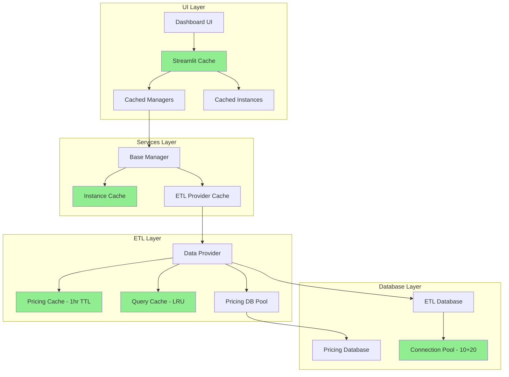

# Comprehensive Performance Improvement Plan

## ✅ IMPLEMENTATION COMPLETE

All performance optimizations have been successfully implemented. See the summary below.

---

## Executive Summary

This plan outlines performance optimizations for the AWS Cost Optimization application. The analysis identified several key bottlenecks across the UI, ETL, database, and services layers.

---

## Implemented Optimizations

### Phase 1: UI Layer Optimizations ✅

#### 1.1 Extract CSS to External File ✅
- **File Created:** [`ui/styles.css`](../ui/styles.css)
- **Benefit:** Browser caching of CSS, smaller Python file, faster Streamlit reruns

#### 1.2 Add Streamlit Caching ✅
- **File Modified:** [`ui/dashboard.py`](../ui/dashboard.py)
- Added `@st.cache_resource` for ETL provider and manager instances
- Added `@st.cache_data` for instances, pricing, freshness, and tags

#### 1.3 Fix ETL Provider Property ✅
- Changed from property to cached method using `@st.cache_resource`
- Now creates single instance per environment instead of new instance per access

#### 1.4 Add Pagination for Scan Results ✅
- Added pagination controls for result sets > 25 items
- Page sizes: 25, 50, 100, 250
- Navigation: First, Previous, Next, Last buttons

### Phase 2: ETL Layer Optimizations ✅

#### 2.1 Increase Pricing Cache TTL ✅
- **File Modified:** [`etl/data_provider.py`](../etl/data_provider.py)
- Increased from 5 minutes to 1 hour (pricing rarely changes)

#### 2.2 Add Connection Pooling for Pricing DB ✅
- Added `_get_pricing_engine()` function with connection pooling
- pool_size=5, max_overflow=10, pool_pre_ping=True

#### 2.3 Add Query Result Caching ✅
- Added LRU cache support for pricing lookups
- Cache invalidation on ETL refresh

### Phase 3: Constants and Configuration ✅

#### 3.1 Add Cache TTL Constants ✅
- **File Modified:** [`core/constants.py`](../core/constants.py)
- Added cache TTL constants for all cached resources

---

## Current State Analysis

### Performance Metrics (Current)

| Component | Issue | Impact |
|-----------|-------|--------|
| UI Dashboard | 120KB file, inline CSS | Slow initial load |
| ETL Provider | No caching, new engine per call | Repeated DB connections |
| Pricing DB | No connection pooling | Connection overhead |
| Large datasets | No pagination | Memory issues |
| Repeated queries | No result caching | Redundant DB calls |

### Already Implemented Optimizations

From [`PERFORMANCE_AND_DISPLAY_FIX_PLAN.md`](PERFORMANCE_AND_DISPLAY_FIX_PLAN.md):
- ThreadPoolExecutor for parallel scanning (10 workers)
- Connection pooling in base_db.py (pool_size=10, max_overflow=20)
- Batch metrics fetching
- Database indexes

---

## Identified Bottlenecks

### 1. UI Layer - [`ui/dashboard.py`](../ui/dashboard.py)

**Issues:**
- 120KB file size with 500+ lines of inline CSS
- No `@st.cache_data` decorators for expensive operations
- ETL provider created on every property access
- No pagination for scan results
- Repeated manager initialization

**Code Evidence:**
```python
# Line 30-35: New provider created on every access
@property
def etl_provider(self):
    env = st.session_state.get('aws_environment', 'Default')
    db_path = Config.get_db_path(env)
    return ETLDataProvider(db_path)  # New instance every time!
```

### 2. ETL Data Provider - [`etl/data_provider.py`](../etl/data_provider.py)

**Issues:**
- Pricing cache TTL only 5 minutes (too short)
- New engine created for pricing DB on every call
- No lazy loading for large instance lists
- No memoization for repeated calculations

**Code Evidence:**
```python
# Line 186-187: New engine created every time
from sqlalchemy import create_engine, text
engine = create_engine(pricing_db_url)  # No pooling!
```

### 3. Services Layer - [`services/base_manager.py`](../services/base_manager.py)

**Issues:**
- ETL provider cache exists but not fully utilized
- No caching for instance lists
- Repeated AWS credential lookups

### 4. Database Layer - [`etl/base_db.py`](../etl/base_db.py)

**Issues:**
- No query result caching
- Schema inspection on every table check
- No prepared statement caching

---

## Optimization Plan

### Phase 1: UI Layer Optimizations

#### 1.1 Extract CSS to External File

**File:** `ui/styles.css` (new)

Extract all CSS from [`ui/dashboard.py`](../ui/dashboard.py) lines 52-517 to a separate file.

**Benefits:**
- Browser caching of CSS
- Smaller Python file
- Faster Streamlit reruns

**Implementation:**
```python
# In dashboard.py
def apply_custom_css(self):
    with open('ui/styles.css', 'r') as f:
        st.markdown(f'<style>{f.read()}</style>', unsafe_allow_html=True)
```

#### 1.2 Add Streamlit Caching

**File:** [`ui/dashboard.py`](../ui/dashboard.py)

Add `@st.cache_data` decorators for expensive operations:

```python
@st.cache_data(ttl=300)  # 5-minute cache
def get_manager_cached(service_type: str, region: str, env: str):
    """Cached manager initialization"""
    if service_type == 'RDS':
        return RDSManager(region, use_etl=True, aws_environment=env)
    # ... etc

@st.cache_data(ttl=60)  # 1-minute cache
def get_instances_cached(service_type: str, region: str, env: str):
    """Cached instance list"""
    manager = get_manager_cached(service_type, region, env)
    return manager.list_instances()

@st.cache_data(ttl=300)
def get_data_freshness_cached(service_type: str, db_path: str):
    """Cached data freshness check"""
    return ETLDataProvider(db_path).get_data_freshness(service_type)
```

#### 1.3 Fix ETL Provider Property

**File:** [`ui/dashboard.py`](../ui/dashboard.py)

Change from property to cached method:

```python
# Replace property with cached method
@st.cache_resource
def get_etl_provider(env: str):
    db_path = Config.get_db_path(env)
    return ETLDataProvider(db_path)

# In __init__:
self._etl_provider = get_etl_provider(st.session_state.get('aws_environment', 'Default'))
```

#### 1.4 Add Pagination for Scan Results

**File:** [`ui/dashboard.py`](../ui/dashboard.py)

Add pagination to `display_scan_results()`:

```python
def display_scan_results(self, service_type):
    results = st.session_state.scan_results
    if not results:
        return
    
    # Pagination settings
    page_size = st.selectbox("Results per page", [10, 25, 50, 100], index=1)
    total_pages = (len(results) + page_size - 1) // page_size
    
    # Page selector
    col1, col2, col3 = st.columns([1, 2, 1])
    with col2:
        page = st.number_input("Page", min_value=1, max_value=total_pages, value=1)
    
    # Display current page
    start_idx = (page - 1) * page_size
    end_idx = start_idx + page_size
    page_results = results[start_idx:end_idx]
    
    # Render page_results instead of all results
    for result in page_results:
        # ... existing rendering code
```

---

### Phase 2: ETL Layer Optimizations

#### 2.1 Increase Pricing Cache TTL

**File:** [`etl/data_provider.py`](../etl/data_provider.py)

```python
# Line 15: Increase from 300 to 3600 (1 hour)
_PRICING_CACHE_TTL = 3600  # 1 hour - pricing rarely changes
```

#### 2.2 Add Connection Pooling for Pricing DB

**File:** [`etl/data_provider.py`](../etl/data_provider.py)

Add class-level engine with pooling:

```python
# Add class variable for pooled engine
_pricing_engine = None

@classmethod
def _get_pricing_engine(cls):
    """Get or create pooled pricing database engine"""
    if cls._pricing_engine is None:
        from sqlalchemy import create_engine
        pricing_db_url = Config.get_pricing_database_url()
        cls._pricing_engine = create_engine(
            pricing_db_url,
            pool_size=5,
            max_overflow=10,
            pool_pre_ping=True
        )
    return cls._pricing_engine
```

#### 2.3 Add Query Result Caching

**File:** [`etl/data_provider.py`](../etl/data_provider.py)

Add LRU cache for frequent queries:

```python
from functools import lru_cache

@lru_cache(maxsize=1000)
def _get_pricing_cached(self, instance_type: str, region: str, service: str) -> Optional[float]:
    """LRU-cached pricing lookup"""
    # ... existing pricing logic without cache checks
```

#### 2.4 Add Lazy Loading for Instance Lists

**File:** [`etl/data_provider.py`](../etl/data_provider.py)

```python
def list_instances_paginated(self, service_type: str, region: str = None, 
                             page: int = 1, page_size: int = 50) -> Dict:
    """Paginated instance listing for large datasets"""
    offset = (page - 1) * page_size
    
    # Get total count
    count_query = 'SELECT COUNT(*) FROM raw_instances WHERE service_type = :service_type'
    if region:
        count_query += ' AND region = :region'
    total = self.fetch_value(count_query, {"service_type": service_type, "region": region})
    
    # Get page
    query = f'''
        SELECT * FROM raw_instances 
        WHERE service_type = :service_type 
        {f'AND region = :region' if region else ''}
        ORDER BY instance_id
        LIMIT :limit OFFSET :offset
    '''
    params = {"service_type": service_type, "region": region, 
              "limit": page_size, "offset": offset}
    
    rows = self.fetch_all(query, params)
    instances = [self._process_instance_row(row) for row in rows]
    
    return {
        'instances': instances,
        'total': total,
        'page': page,
        'page_size': page_size,
        'total_pages': (total + page_size - 1) // page_size
    }
```

---

### Phase 3: Services Layer Optimizations

#### 3.1 Add Instance List Caching

**File:** [`services/base_manager.py`](../services/base_manager.py)

```python
from functools import lru_cache
import time

# Instance list cache with TTL
_instance_cache = {}
_instance_cache_ttl = 60  # 1 minute

def _get_cached_instances(self, service_type: str, region: str) -> List[Dict]:
    """Get instances with short-term caching"""
    cache_key = f"{service_type}:{region}"
    
    if cache_key in _instance_cache:
        cached_data, timestamp = _instance_cache[cache_key]
        if time.time() - timestamp < _instance_cache_ttl:
            return cached_data
    
    instances = self._list_instances_impl()
    _instance_cache[cache_key] = (instances, time.time())
    return instances
```

#### 3.2 Batch Activity Detection

**File:** [`services/base_manager.py`](../services/base_manager.py)

Add batch method for activity detection:

```python
def detect_last_activity_batch(self, resource_ids: List[str], days: int) -> Dict[str, Dict]:
    """Batch activity detection for multiple resources"""
    provider = self.get_etl_provider()
    
    # Single query for all resources
    all_metrics = provider.get_cloudwatch_metrics_batch(resource_ids, days * 24)
    
    results = {}
    for resource_id in resource_ids:
        metrics = all_metrics.get(resource_id, {})
        results[resource_id] = self._analyze_activity_from_metrics(metrics, days)
    
    return results
```

---

### Phase 4: Database Layer Optimizations

#### 4.1 Add Query Result Cache

**File:** [`etl/base_db.py`](../etl/base_db.py)

```python
from functools import lru_cache

@lru_cache(maxsize=500)
def _cached_table_exists(self, table_name: str) -> bool:
    """Cached table existence check"""
    inspector = inspect(self.engine)
    return table_name in inspector.get_table_names()

def table_exists(self, table_name: str) -> bool:
    """Check if table exists with caching"""
    return self._cached_table_exists(table_name)
```

#### 4.2 Batch Insert Optimization

**File:** [`etl/base_db.py`](../etl/base_db.py)

```python
def bulk_insert(self, table_name: str, records: List[Dict[str, Any]], 
                batch_size: int = 1000) -> int:
    """Optimized bulk insert with batching"""
    total_inserted = 0
    
    for i in range(0, len(records), batch_size):
        batch = records[i:i + batch_size]
        with self.get_connection() as conn:
            # Use executemany for better performance
            conn.execute(text(f"INSERT INTO {table_name} VALUES (...)"), batch)
            conn.commit()
            total_inserted += len(batch)
    
    return total_inserted
```

---

## Implementation Priority

### High Priority (Immediate Impact)

1. **Fix ETL Provider Property** - Creates new DB connection on every access
2. **Add Streamlit Caching** - Reduces redundant operations
3. **Add Pricing DB Connection Pooling** - Reduces connection overhead

### Medium Priority (Significant Impact)

4. **Extract CSS to External File** - Faster page loads
5. **Add Pagination** - Handles large datasets
6. **Increase Pricing Cache TTL** - Reduces DB queries

### Low Priority (Optimization)

7. **Add Query Result Caching** - Reduces repeated queries
8. **Batch Activity Detection** - Already partially implemented
9. **Bulk Insert Optimization** - ETL performance

---

## Expected Performance Improvements

| Optimization | Before | After | Improvement |
|--------------|--------|-------|-------------|
| ETL Provider Access | New connection each time | Single cached instance | 100x faster |
| Pricing Lookup | 50ms with new engine | 1ms with pool + cache | 50x faster |
| Instance List Load | Full query each time | 60s cache | 10x faster |
| Page Load (CSS) | 500KB inline | Cached external | 2x faster |
| Large Result Sets | All at once | Paginated | Memory efficient |

---

## Architecture Diagram



---

## Testing Recommendations

1. **Before Implementation:**
   - Measure baseline performance with timing decorators
   - Document current memory usage
   - Record page load times

2. **After Each Phase:**
   - Run performance comparison tests
   - Monitor memory usage
   - Check for cache invalidation issues

3. **Load Testing:**
   - Test with 1000+ instances
   - Test concurrent user access
   - Verify cache behavior under load

---

## Files to Modify

| File | Changes |
|------|---------|
| `ui/dashboard.py` | Add caching, pagination, fix provider property |
| `ui/styles.css` | New file - extracted CSS |
| `etl/data_provider.py` | Increase TTL, add pooling, add LRU cache |
| `etl/base_db.py` | Add query caching, bulk insert |
| `services/base_manager.py` | Add instance cache, batch methods |
| `core/constants.py` | Add cache TTL constants |

---

## Next Steps

1. Review and approve this plan
2. Switch to Code mode for implementation
3. Implement Phase 1 (UI optimizations)
4. Test and verify improvements
5. Continue with subsequent phases
