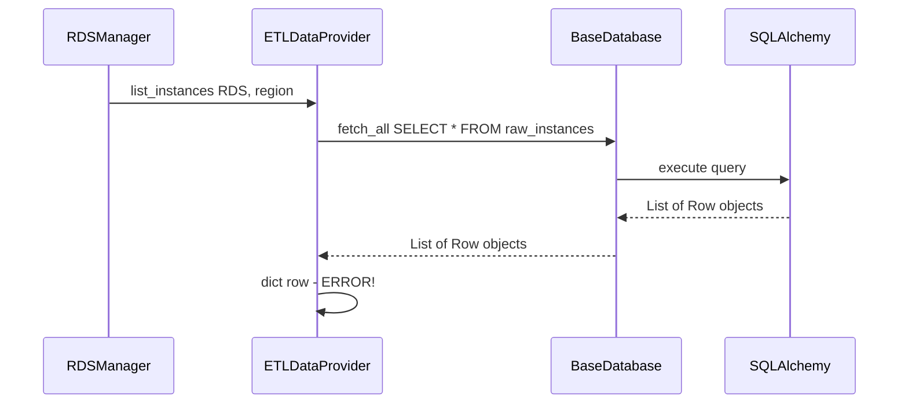

# Fix Plan: RDS Dictionary Update Error

## Problem Summary

**Error Message:**
```
Error fetching RDS instances from ETL: dictionary update sequence element #0 has length 29; 2 is required
```

## Root Cause Analysis

### Location
The error occurs in [`etl/data_provider.py`](etl/data_provider.py:194) at line 194:

```python
instance = dict(row)
```

### Explanation
The `fetch_all()` method in [`etl/base_db.py`](etl/base_db.py:114) returns SQLAlchemy `Row` objects. When calling `dict(row)` on a SQLAlchemy 2.x `Row` object, Python attempts to interpret the row as a sequence of key-value pairs (tuples with exactly 2 elements).

Since the `raw_instances` table has **29 columns**, the Row object contains 29 values. When `dict()` is called:
1. It iterates over the Row (which yields individual values, not key-value pairs)
2. The first element has 29 items (the entire row's values)
3. `dict()` expects each element to be a 2-tuple (key, value)
4. Hence the error: "element #0 has length 29; 2 is required"

### Code Flow



## Solution

### Fix Method
Replace `dict(row)` with the proper SQLAlchemy 2.x method to convert Row to dictionary:

**Applied Fix:**
```python
instance = dict(row._mapping) if hasattr(row, '_mapping') else dict(row)
```

The `_mapping` attribute is the recommended approach in SQLAlchemy 2.x as it provides a mapping interface for the Row object.

## Files Modified

✅ **[`etl/data_provider.py`](etl/data_provider.py)** - Fixed 5 locations:

| Line | Method | Status |
|------|--------|--------|
| 195 | `list_instances()` | ✅ Fixed |
| 219 | `get_ebs_volumes_for_instance()` | ✅ Fixed |
| 300 | `get_idle_analysis()` | ✅ Fixed |
| 528 | `get_all_ebs_volumes()` | ✅ Fixed |
| 552 | `get_ebs_volumes_by_instance()` | ✅ Fixed |

## Testing

After applying the fix:
1. Run the ETL process to populate the database
2. Access the RDS dashboard to verify instances are loaded correctly
3. Check the logs for any remaining errors

## Status: ✅ COMPLETED

All occurrences of `dict(row)` have been updated to use the SQLAlchemy 2.x compatible `row._mapping` approach.
