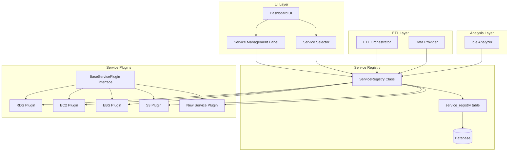
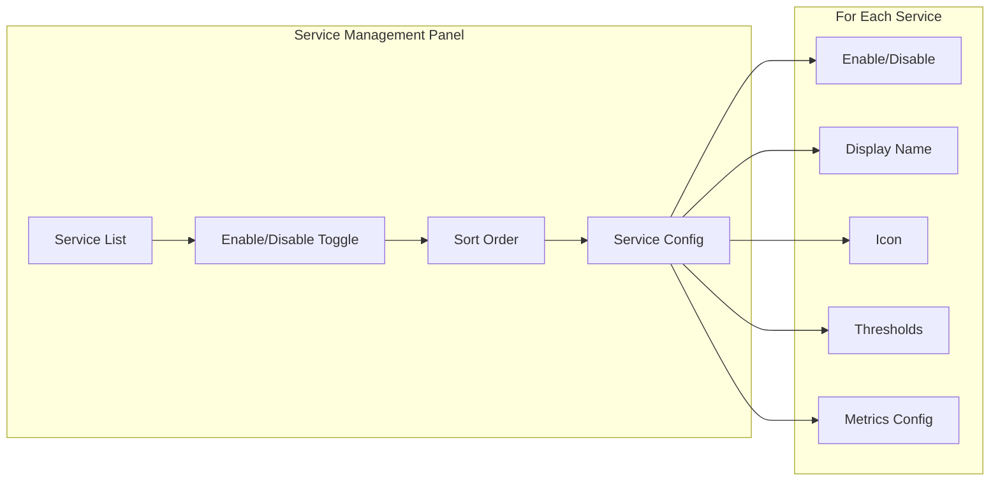

# Pluggable AWS Services Architecture

## Overview

This document outlines the architecture for making AWS services pluggable and unpluggable in the AWS Cost Optimizer application. The design allows administrators to enable/disable services via the UI, with changes persisting in the database and affecting both the UI and ETL processes.

## Current State Analysis

### Hardcoded Services

Currently, AWS services are hardcoded across multiple files:

| File | Hardcoded Elements |
|------|-------------------|
| [`ui/dashboard.py`](ui/dashboard.py:667-674) | Service selector: `['RDS', 'EC2', 'EBS', 'S3']` |
| [`etl/orchestrator.py`](etl/orchestrator.py:328) | Default services: `['RDS', 'EC2', 'EBS', 'S3']` |
| [`etl/orchestrator.py`](etl/orchestrator.py:337-346) | Service extraction methods: `_extract_rds`, `_extract_ec2`, `_extract_ebs`, `_extract_s3` |
| [`services/__init__.py`](services/__init__.py) | Empty - no service registry |
| [`analysis/idle_analyzer.py`](analysis/idle_analyzer.py:25) | Service-specific analysis methods |

### Current Service Manager Pattern

Each service has a manager class inheriting from [`BaseServiceManager`](services/base_manager.py:12):

- [`RDSManager`](services/rds_manager.py:17)
- [`EC2Manager`](services/ec2_manager.py:10)
- [`EBSManager`](services/ebs_manager.py)
- [`S3Manager`](services/s3_manager.py)

## Proposed Architecture

### High-Level Architecture Diagram



### Component Design

#### 1. Service Registry Database Schema

```sql
CREATE TABLE IF NOT EXISTS service_registry (
    service_id VARCHAR(50) PRIMARY KEY,
    service_name VARCHAR(100) NOT NULL,
    display_name VARCHAR(100) NOT NULL,
    description TEXT,
    icon VARCHAR(10),
    is_enabled BOOLEAN DEFAULT TRUE,
    plugin_class VARCHAR(255) NOT NULL,
    config_json TEXT,
    created_at TIMESTAMP DEFAULT CURRENT_TIMESTAMP,
    updated_at TIMESTAMP DEFAULT CURRENT_TIMESTAMP,
    created_by VARCHAR(100),
    sort_order INTEGER DEFAULT 0
);

CREATE TABLE IF NOT EXISTS service_metrics_config (
    config_id SERIAL PRIMARY KEY,
    service_id VARCHAR(50) REFERENCES service_registry(service_id),
    metric_name VARCHAR(100) NOT NULL,
    display_name VARCHAR(100),
    namespace VARCHAR(100),
    dimension_name VARCHAR(100),
    statistic VARCHAR(20) DEFAULT 'Average',
    unit VARCHAR(50),
    idle_threshold REAL,
    weight REAL,
    is_active BOOLEAN DEFAULT TRUE
);

CREATE TABLE IF NOT EXISTS service_thresholds (
    threshold_id SERIAL PRIMARY KEY,
    service_id VARCHAR(50) REFERENCES service_registry(service_id),
    threshold_name VARCHAR(100) NOT NULL,
    threshold_value REAL NOT NULL,
    description TEXT,
    created_at TIMESTAMP DEFAULT CURRENT_TIMESTAMP
);
```

#### 2. Abstract Service Plugin Interface

```python
# services/base_plugin.py

from abc import ABC, abstractmethod
from typing import Dict, List, Any, Optional
from dataclasses import dataclass

@dataclass
class ServiceConfig:
    """Configuration for a service plugin"""
    service_id: str
    display_name: str
    description: str
    icon: str
    metrics: List[Dict]
    thresholds: Dict[str, float]
    sort_order: int = 0

class BaseServicePlugin(ABC):
    """Abstract base class for all service plugins"""
    
    @property
    @abstractmethod
    def service_id(self) -> str:
        """Unique identifier for the service"""
        pass
    
    @property
    @abstractmethod
    def display_name(self) -> str:
        """Human-readable name for UI display"""
        pass
    
    @property
    def description(self) -> str:
        """Service description for UI"""
        return ""
    
    @property
    def icon(self) -> str:
        """Emoji icon for UI"""
        return "📦"
    
    @property
    def sort_order(self) -> int:
        """Order in which service appears in UI"""
        return 0
    
    @abstractmethod
    def get_manager_class(self) -> type:
        """Return the service manager class"""
        pass
    
    @abstractmethod
    def get_metrics_config(self) -> List[Dict]:
        """Return CloudWatch metrics configuration"""
        pass
    
    @abstractmethod
    def get_idle_thresholds(self) -> Dict[str, float]:
        """Return idle detection thresholds"""
        pass
    
    @abstractmethod
    def get_etl_extractor(self):
        """Return the ETL extraction function for this service"""
        pass
    
    def get_analyzer_function(self):
        """Return the idle analyzer function for this service"""
        return None
    
    def get_instance_id_field(self) -> str:
        """Return the primary identifier field name"""
        return 'instance_id'
    
    def get_display_fields(self) -> List[str]:
        """Return fields to display in UI cards"""
        return []
```

#### 3. Service Registry Class

```python
# services/registry.py

from typing import Dict, List, Optional, Type
from importlib import import_module

class ServiceRegistry:
    """Central registry for all service plugins"""
    
    _instance = None
    _plugins: Dict[str, 'BaseServicePlugin'] = {}
    
    def __new__(cls):
        if cls._instance is None:
            cls._instance = super().__new__(cls)
        return cls._instance
    
    def register(self, plugin: 'BaseServicePlugin') -> None:
        """Register a service plugin"""
        self._plugins[plugin.service_id] = plugin
    
    def get_plugin(self, service_id: str) -> Optional['BaseServicePlugin']:
        """Get a registered plugin by service ID"""
        return self._plugins.get(service_id)
    
    def get_all_plugins(self) -> Dict[str, 'BaseServicePlugin']:
        """Get all registered plugins"""
        return self._plugins
    
    def get_enabled_plugins(self, db_connection) -> Dict[str, 'BaseServicePlugin']:
        """Get plugins that are enabled in the database"""
        enabled_ids = self._fetch_enabled_services(db_connection)
        return {
            sid: plugin 
            for sid, plugin in self._plugins.items() 
            if sid in enabled_ids
        }
    
    def _fetch_enabled_services(self, db_connection) -> List[str]:
        """Fetch enabled service IDs from database"""
        # Query service_registry table for is_enabled = TRUE
        pass
    
    def auto_discover_plugins(self) -> None:
        """Auto-discover and register plugins from services directory"""
        # Scan services directory for plugin modules
        pass
```

#### 4. Example Plugin Implementation

```python
# services/plugins/rds_plugin.py

from services.base_plugin import BaseServicePlugin, ServiceConfig
from services.rds_manager import RDSManager

class RDSPlugin(BaseServicePlugin):
    """RDS Service Plugin"""
    
    @property
    def service_id(self) -> str:
        return 'RDS'
    
    @property
    def display_name(self) -> str:
        return 'RDS'
    
    @property
    def description(self) -> str:
        return 'Amazon Relational Database Service'
    
    @property
    def icon(self) -> str:
        return '🗄️'
    
    @property
    def sort_order(self) -> int:
        return 1
    
    def get_manager_class(self) -> type:
        return RDSManager
    
    def get_metrics_config(self) -> List[Dict]:
        return [
            {
                'name': 'CPUUtilization',
                'namespace': 'AWS/RDS',
                'dimension': 'DBInstanceIdentifier',
                'statistic': 'Average',
                'unit': 'Percent',
                'idle_threshold': 5.0,
                'weight': 25
            },
            {
                'name': 'DatabaseConnections',
                'namespace': 'AWS/RDS',
                'dimension': 'DBInstanceIdentifier',
                'statistic': 'Average',
                'unit': 'Count',
                'idle_threshold': 0.5,
                'weight': 20
            },
            # ... more metrics
        ]
    
    def get_idle_thresholds(self) -> Dict[str, float]:
        return {
            'cpu_idle_threshold': 5.0,
            'cpu_critical_threshold': 1.0,
            'connections_idle_threshold': 0.5,
            'read_iops_idle_threshold': 1.0,
            'write_iops_idle_threshold': 1.0,
            'network_idle_threshold': 1000.0
        }
    
    def get_etl_extractor(self):
        from etl.extractors import extract_rds
        return extract_rds
    
    def get_analyzer_function(self):
        from analysis.idle_analyzer import IdleAnalyzer
        return IdleAnalyzer.analyze_rds
    
    def get_instance_id_field(self) -> str:
        return 'instance_id'
    
    def get_display_fields(self) -> List[str]:
        return ['instance_class', 'engine', 'status', 'allocated_storage']
```

### UI Components

#### Service Management Panel

A new admin panel for managing services:



#### Updated Service Selector

The service selector will dynamically populate from enabled services:

```python
# In dashboard.py
def render_service_selector(self):
    registry = ServiceRegistry()
    enabled_plugins = registry.get_enabled_plugins(self.db_connection)
    
    service_options = [
        f"{plugin.icon} {plugin.display_name}" 
        for plugin in sorted(enabled_plugins.values(), key=lambda p: p.sort_order)
    ]
    
    selected = st.segmented_control(
        "Select AWS Service:",
        options=service_options,
        # ...
    )
```

### ETL Integration

The ETL orchestrator will use the service registry:

```python
# In orchestrator.py
def run_etl(self, services=None, regions=None, aws_environment='Default'):
    registry = ServiceRegistry()
    
    # Get enabled services from database
    enabled_plugins = registry.get_enabled_plugins(self.db_connection)
    
    # If specific services requested, filter to those
    if services:
        enabled_plugins = {
            k: v for k, v in enabled_plugins.items() 
            if k in services
        }
    
    for service_id, plugin in enabled_plugins.items():
        extractor = plugin.get_etl_extractor()
        for region in regions or ['us-east-1']:
            instances, metrics = extractor(region, aws_environment)
            self._load_data(service_id, region, instances, metrics)
```

### Adding a New Service

To add a new service, developers will:

1. **Create a Service Manager** (existing pattern):
   ```python
   # services/lambda_manager.py
   class LambdaManager(BaseServiceManager):
       # ... implementation
   ```

2. **Create a Plugin Class**:
   ```python
   # services/plugins/lambda_plugin.py
   class LambdaPlugin(BaseServicePlugin):
       # ... implement all abstract methods
   ```

3. **Register the Plugin**:
   ```python
   # services/plugins/__init__.py
   from .lambda_plugin import LambdaPlugin
   
   def register_all_plugins():
       registry = ServiceRegistry()
       registry.register(LambdaPlugin())
   ```

4. **Enable in UI**:
   - Navigate to Service Management Panel
   - Enable the new service
   - Configure thresholds if needed

### Migration Strategy

1. **Phase 1: Create Infrastructure**
   - Add database tables
   - Create base plugin class
   - Create service registry

2. **Phase 2: Migrate Existing Services**
   - Create plugin classes for RDS, EC2, EBS, S3
   - Update managers to work with plugins
   - Update ETL to use registry

3. **Phase 3: Update UI**
   - Add service management panel
   - Update service selector to be dynamic
   - Update analysis views to use plugin config

4. **Phase 4: Testing & Documentation**
   - Test enable/disable functionality
   - Test ETL with different service combinations
   - Write developer guide for adding services

## File Structure

```
services/
├── __init__.py              # Export registry and base classes
├── base_manager.py          # Existing - unchanged
├── base_plugin.py           # NEW - Abstract plugin interface
├── registry.py              # NEW - Service registry
├── rds_manager.py           # Existing - minor updates
├── ec2_manager.py           # Existing - minor updates
├── ebs_manager.py           # Existing - minor updates
├── s3_manager.py            # Existing - minor updates
└── plugins/                 # NEW - Plugin implementations
    ├── __init__.py
    ├── rds_plugin.py
    ├── ec2_plugin.py
    ├── ebs_plugin.py
    └── s3_plugin.py

etl/
├── orchestrator.py          # Updated - use registry
└── extractors/              # NEW - Modular extractors
    ├── __init__.py
    ├── base_extractor.py
    ├── rds_extractor.py
    ├── ec2_extractor.py
    ├── ebs_extractor.py
    └── s3_extractor.py

ui/
├── dashboard.py             # Updated - dynamic service loading
└── components/              # NEW - UI components
    ├── __init__.py
    ├── service_selector.py
    └── service_management.py

database/
└── migrations/
    └── add_service_registry.py  # NEW - Migration script
```

## Benefits

1. **Easy Service Addition**: New services can be added by creating a plugin class
2. **Runtime Configuration**: Services can be enabled/disabled without code changes
3. **Centralized Configuration**: All service configs in one place
4. **Better Testing**: Each plugin can be tested independently
5. **Extensibility**: Third-party services can be added as plugins
6. **Audit Trail**: Track when services were enabled/disabled

## Implementation Checklist

- [ ] Create database migration for service_registry tables
- [ ] Implement `BaseServicePlugin` abstract class
- [ ] Implement `ServiceRegistry` singleton
- [ ] Create plugin classes for existing services
- [ ] Update ETL orchestrator to use registry
- [ ] Update dashboard to use dynamic service loading
- [ ] Create service management UI panel
- [ ] Write unit tests for plugin system
- [ ] Create developer documentation
- [ ] Test migration on existing databases
