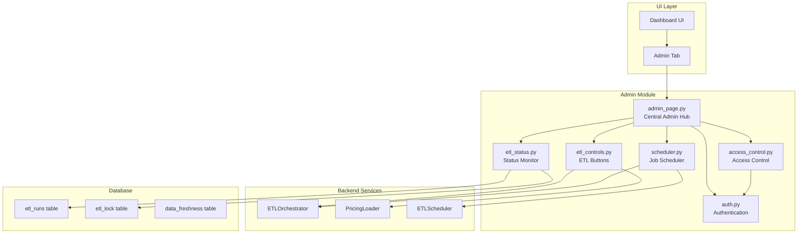

# Admin Module Migration Plan - Cloud Shell

## Executive Summary

This plan outlines the migration of all admin-related components from the AWS Idle Instance Monitor application into a centralized admin module. The goal is to consolidate administrative functions while preserving existing functionality and routing structure.

---

## 1. Current Admin Components Identified

### 1.1 Authentication & Access Control
- **Location**: `utils/auth.py`, `ui/dashboard.py` (lines 126-248), `ui/dashboard/components.py` (lines 11-92)
- **Features**:
  - Multiple admin users from `ADMIN_USERS` env variable
  - Bcrypt password hashing
  - Session management with configurable timeout
  - Password change functionality

### 1.2 ETL Controls
- **Location**: `ui/dashboard.py` (lines 489-570), `etl/orchestrator.py`
- **Features**:
  - "Refresh Data" button - triggers `truncate_and_reload()` via ETLDataProvider
  - "Reload Pricing" button - triggers PricingLoader.run_etl()
  - ETL lock status display and force unlock capability
  - Admin-only access control

### 1.3 Pricing Model Settings
- **Location**: `ui/dashboard.py` (lines 921-996), `ui/dashboard/components.py` (lines 396-471)
- **Features**:
  - Pricing model selection (On-Demand, Reserved Instances, Savings Plans)
  - RI/Savings Plans coverage percentage
  - Use actual runtime toggle

### 1.4 ETL Execution Tracking
- **Location**: `etl/orchestrator.py` (lines 235-238, 513-540)
- **Features**:
  - `etl_runs` table tracking: run_type, status, start_time, end_time, duration_seconds, records_extracted, records_loaded, error_message, triggered_by, service_flags
  - Lock mechanism in `etl_lock` table

### 1.5 ETL Scheduling
- **Location**: `etl/scheduler.py`
- **Features**:
  - BackgroundScheduler for periodic ETL
  - Configurable schedule time (default: 02:00)
  - Daily job execution

---

## 2. Target Admin Module Architecture

```
ui/
├── dashboard/
│   ├── __init__.py
│   ├── admin/
│   │   ├── __init__.py          # New - Admin module exports
│   │   ├── admin_page.py       # New - Centralized admin page
│   │   ├── auth.py              # Migrated from utils/auth.py
│   │   ├── etl_controls.py     # Migrated - ETL trigger buttons
│   │   ├── etl_status.py       # New - ETL execution monitoring
│   │   ├── scheduler.py         # New - Job scheduling UI
│   │   └── access_control.py   # New - Admin access controls
│   ├── components.py
│   ├── cache.py
│   ├── helpers.py
│   └── views_single_analysis.py
```

---

## 3. Implementation Plan

### Phase 1: Create Admin Module Structure

#### Step 1.1: Create admin package directory
- Create `ui/dashboard/admin/` directory
- Create `__init__.py` with module exports

#### Step 1.2: Create admin page entry point
- File: `ui/dashboard/admin/admin_page.py`
- Function: `render_admin_page()`
- Integrates all admin sub-sections

### Phase 2: Migrate Authentication

#### Step 2.1: Create admin auth module
- File: `ui/dashboard/admin/auth.py`
- Import and re-export from `utils/auth`
- Add Streamlit-specific rendering functions

#### Step 2.2: Create admin access control
- File: `ui/dashboard/admin/access_control.py`
- Function: `check_admin_access()` - validates admin session
- Function: `require_admin()` - gate for admin-only actions

### Phase 3: Migrate ETL Controls

#### Step 3.1: Create ETL controls module
- File: `ui/dashboard/admin/etl_controls.py`
- Function: `render_etl_buttons()` - "Refresh Data" and "Reload Pricing"
- Function: `render_etl_lock_status()` - lock display and force unlock

#### Step 3.2: Create ETL status monitoring
- File: `ui/dashboard/admin/etl_status.py`
- Function: `render_etl_history()` - displays recent ETL runs from `etl_runs` table
- Function: `render_etl_metrics()` - success rate, avg duration, records loaded

### Phase 4: Add ETL Scheduling UI

#### Step 4.1: Create scheduler UI module
- File: `ui/dashboard/admin/scheduler.py`
- Function: `render_scheduler_settings()`
- Configure schedule time, enable/disable scheduling
- Display next scheduled run

### Phase 5: Integrate into Dashboard

#### Step 5.1: Add admin tab in main dashboard
- Modify `ui/dashboard.py`
- Add tab navigation: [Dashboard] [Single Analysis] [Admin]
- Render admin page in Admin tab

#### Step 5.2: Preserve backward compatibility
- Keep existing sidebar structure intact
- Admin page available as new tab but sidebar options remain functional
- No breaking changes to existing routing

---

## 4. Mermaid Diagram: Admin Module Architecture



---

## 5. Key Features of New Admin Page

### 5.1 Tab Structure

| Tab | Description |
|-----|-------------|
| **Overview** | System status, last ETL run, data freshness |
| **Data Management** | Refresh Data, Reload Pricing, Force Unlock |
| **Scheduling** | Configure ETL schedule, view next run |
| **Execution History** | ETL run history, success/failure metrics |
| **Settings** | Pricing model, access control |

### 5.2 Admin Access Controls

- Session-based authentication (existing)
- Role check: `is_admin` session state
- All admin actions gated behind authentication
- Audit logging for admin actions (future enhancement)

### 5.3 ETL Integration

| Feature | Description | Method |
|---------|-------------|--------|
| **Refresh Data** | Truncate and reload all AWS data | `etl_provider.truncate_and_reload()` |
| **Reload Pricing** | Update pricing cache | `PricingLoader.run_etl()` |
| **Force Unlock** | Release stale ETL lock | `orchestrator.force_unlock()` |
| **View History** | Query etl_runs table | `fetch_all()` |
| **Schedule Jobs** | Configure BackgroundScheduler | `ETLScheduler.start()` |

---

## 6. Backward Compatibility

### 6.1 Preserve Existing Routing
- Main dashboard entry: `streamlit run main.py` → `ui/dashboard.py:main()`
- Existing sidebar rendered as-is in main tab
- Admin page available as additional tab, not replacement

### 6.2 Preserve Existing Functionality
- All ETL operations unchanged
- Database schema unchanged
- API interfaces unchanged

### 6.3 Gradual Migration Path
- Phase 1: Admin page available as tab
- Phase 2: Deprecate sidebar admin section (optional)
- Phase 3: Full migration complete

---

## 7. File Changes Summary

| Action | File | Description |
|--------|------|-------------|
| CREATE | `ui/dashboard/admin/__init__.py` | Module exports |
| CREATE | `ui/dashboard/admin/admin_page.py` | Central admin hub |
| CREATE | `ui/dashboard/admin/auth.py` | Admin auth wrapper |
| CREATE | `ui/dashboard/admin/access_control.py` | Access control |
| CREATE | `ui/dashboard/admin/etl_controls.py` | ETL trigger buttons |
| CREATE | `ui/dashboard/admin/etl_status.py` | ETL status display |
| CREATE | `ui/dashboard/admin/scheduler.py` | Job scheduler UI |
| MODIFY | `ui/dashboard.py` | Add admin tab |
| MODIFY | `ui/dashboard/__init__.py` | Add admin module exports |

---

## 8. Testing Plan

### 8.1 Functionality Tests
- [ ] Login/logout works correctly
- [ ] Admin buttons disabled for non-authenticated users
- [ ] Refresh Data triggers ETL successfully
- [ ] Reload Pricing updates pricing cache
- [ ] Force Unlock releases stale lock
- [ ] ETL history displays correctly
- [ ] Scheduler configuration persists

### 8.2 Integration Tests
- [ ] Admin tab renders without errors
- [ ] All admin functions accessible from new location
- [ ] Existing dashboard functionality unaffected

---

## 9. Migration Sequence

1. **Create admin module structure** - Create directories and base files
2. **Migrate authentication** - Move auth UI to admin module
3. **Migrate ETL controls** - Move buttons and lock UI
4. **Add ETL status display** - Create history and metrics views
5. **Add scheduler UI** - Create schedule configuration interface
6. **Integrate into dashboard** - Add admin tab to main UI
7. **Test all functions** - Verify no regressions
8. **Document changes** - Update README and architecture docs
