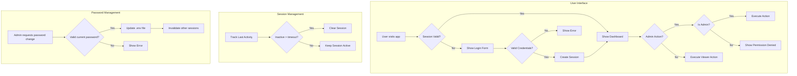

# Authentication Implementation Plan for AWS Cost Optimizer

## Overview

This plan outlines the implementation of role-based authentication to restrict access to sensitive admin operations ("Refresh Data" and "Reload Pricing") to authorized admin users only.

## Current State Analysis

### Security Gap
- **Location**: [`ui/dashboard.py`](ui/dashboard.py:254-286)
- **Issue**: "Refresh Data" and "Reload Pricing" buttons are accessible to all users without authentication
- **Impact**: Any user can trigger ETL processes that:
  - Truncate and reload database data
  - Update pricing cache from AWS
  - Potentially cause data loss or service disruption

### Current Authentication
- None - the application is currently open access

## Requirements

Based on user input:
1. **Credential Storage**: Admin credentials stored in `.env` file
2. **Multiple Admin Users**: Support for multiple admin accounts
3. **Password Change**: Admins can change their own passwords
4. **Session Timeout**: Configurable via `.env` file (default 10 minutes)
5. **Protected Actions**: Only admin users can access "Refresh Data" and "Reload Pricing"

## Architecture Design



## Implementation Details

### 1. Environment Configuration

Add to `.env` file:
```env
# Admin Authentication - Multiple Users Supported
# Format: ADMIN_USERS=username1:hash1,username2:hash2
ADMIN_USERS=admin:$2b$12$...,admin2:$2b$12$...

# Session Configuration
SESSION_TIMEOUT_MINUTES=10

# Password Hash - Generate using: python -c "import bcrypt; print(bcrypt.hashpw(b'your_password', bcrypt.gensalt()).decode())"
```

### 2. New Authentication Module

Create [`utils/auth.py`](utils/auth.py) with:
- `AuthManager` class for authentication logic
- Password hashing using bcrypt
- Session management with configurable inactivity timeout
- Role-based access control
- Multiple admin user support
- Password change functionality with secure .env update

### 3. Session State Structure

```python
st.session_state = {
    'authenticated': False,
    'is_admin': False,
    'username': None,
    'last_activity': datetime,
    'session_expiry': datetime,
    'login_time': datetime
}
```

### 4. Protected Actions

The following actions require admin authentication:
- "Refresh Data" button (ETL truncate and reload)
- "Reload Pricing" button (Pricing ETL)
- "Force Unlock" button (ETL lock release)

### 5. Password Change Feature

- Accessible from sidebar when logged in as admin
- Requires current password verification
- Updates .env file with new bcrypt hash
- Invalidates all other sessions for that user

## File Changes

### Files to Create
| File | Purpose |
|------|---------|
| `utils/auth.py` | Authentication manager class with multi-user support and password change |

### Files to Modify
| File | Changes |
|------|---------|
| `.env.example` | Add admin credential placeholders and session timeout config |
| `core/config.py` | Add auth configuration loading for multiple users |
| `ui/dashboard.py` | Add login UI, protect admin buttons, add password change UI |
| `requirements.txt` | Add bcrypt dependency |

## Implementation Steps

### Step 1: Create Authentication Module
Create `utils/auth.py` with:
- Bcrypt password hashing and verification
- Multiple admin user support (parse from .env)
- Session management with configurable timeout
- Login/logout functionality
- Password change with secure .env update
- Activity tracking for timeout

### Step 2: Update Configuration
Modify `core/config.py` to:
- Load admin users from environment (format: `ADMIN_USERS=user1:hash1,user2:hash2`)
- Load session timeout from environment (default 10 minutes)
- Provide secure password comparison methods
- Support updating user passwords in .env

### Step 3: Update Dashboard UI
Modify `ui/dashboard.py` to:
- Add login form in sidebar
- Show/hide admin buttons based on authentication status
- Add password change dialog for logged-in admins
- Track user activity for timeout
- Display authentication status and remaining session time
- Show logout button when authenticated

### Step 4: Update Dependencies
Add to `requirements.txt`:
```
bcrypt>=4.0.0
```

## Security Considerations

1. **Password Storage**: Passwords stored as bcrypt hashes in `.env`
2. **Multiple Users**: Support for multiple admin accounts with individual credentials
3. **Session Security**: 
   - Sessions expire after configurable inactivity timeout
   - Session state stored server-side (Streamlit session)
4. **Password Changes**: 
   - Requires current password verification
   - Securely updates .env file
   - Maintains file permissions
5. **Brute Force Protection**: Consider adding rate limiting (future enhancement)
6. **HTTPS**: Ensure app runs behind HTTPS in production

## User Experience Flow

### For Viewers (Non-Admin)
1. Access app without login
2. View all dashboards and reports
3. Cannot access admin-only buttons (disabled or hidden)

### For Admin Users
1. Click "Admin Login" in sidebar
2. Enter credentials
3. Session created with configurable timeout
4. Admin buttons become accessible
5. Activity tracked - session refreshes on interaction
6. Auto-logout after inactivity timeout
7. Can change password via sidebar option

### Password Change Flow
1. Admin clicks "Change Password" in sidebar
2. Modal/dialog appears requesting:
   - Current password
   - New password
   - Confirm new password
3. System verifies current password
4. System updates .env with new bcrypt hash
5. Success message displayed
6. Session remains active

## Testing Checklist

- [ ] Login with correct credentials succeeds
- [ ] Login with wrong credentials fails with error message
- [ ] Admin buttons hidden/disabled for non-authenticated users
- [ ] Admin buttons enabled after successful login
- [ ] Session expires after configured inactivity timeout
- [ ] Session refreshes on user activity
- [ ] Logout clears session properly
- [ ] Password hash verification works correctly
- [ ] Multiple admin users can log in independently
- [ ] Password change requires current password verification
- [ ] Password change updates .env file correctly
- [ ] New password works after change
- [ ] Session timeout is configurable via .env

## Future Enhancements

1. ~~Multiple admin users with individual credentials~~ (Included in this implementation)
2. Database-backed user management
3. SSO integration (OAuth, SAML)
4. Audit logging for admin actions
5. Rate limiting for login attempts
6. ~~Password reset functionality~~ (Included in this implementation)
7. Two-factor authentication (2FA)
8. Session management UI (view active sessions)
