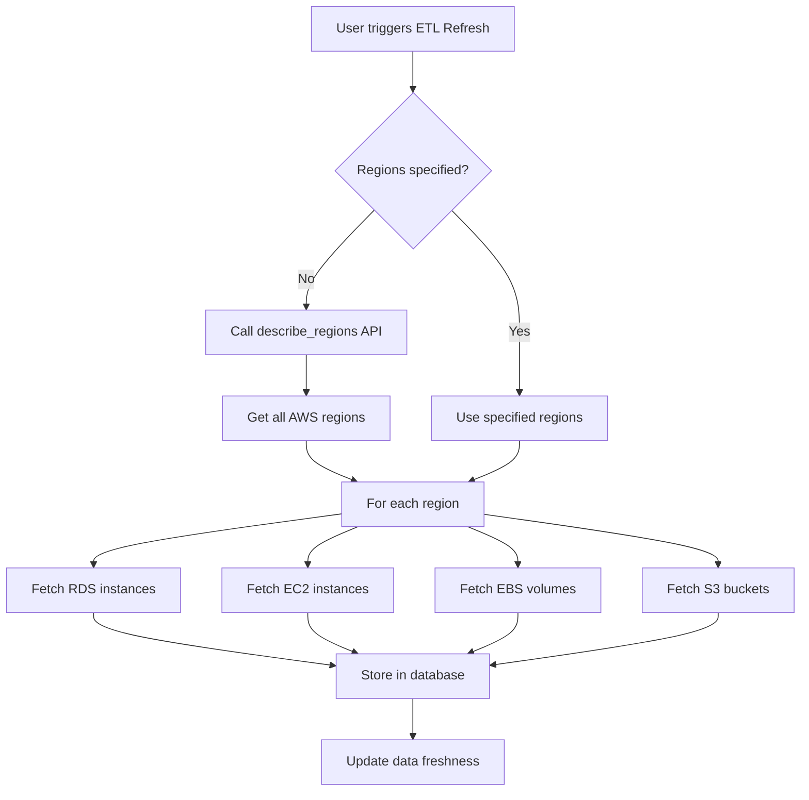

# Multi-Region Support Implementation Plan

## Problem Statement
The AWS Cost Optimization app currently fetches data only from `us-east-1` region by default. This needs to be updated to fetch data from all AWS regions.

## Solution Approach
1. **Refresh Data (ETL)** → Automatically fetch ALL AWS regions and store in database
2. **Region Dropdown (UI)** → Filter and display data for the selected region (already exists)

## Current State Analysis

### Files with Hardcoded `us-east-1`:
1. **`etl/orchestrator.py`** (line 329):
   ```python
   regions = regions or ['us-east-1']
   ```

2. **`etl/data_provider.py`** (line 574-578):
   - `truncate_and_reload()` method calls `run_etl()` without passing regions parameter

3. **`ui/dashboard.py`** (line 422):
   ```python
   regions=['us-east-1'],  # Default region for pricing
   ```

4. **`ui/cli.py`** (line 33):
   ```python
   parser.add_argument('--region', type=str, default='us-east-1')
   ```

## Implementation Plan

### Step 1: Add Region Discovery Method in `etl/orchestrator.py`

Add a new method to dynamically discover all AWS regions using boto3 Session:

```python
def get_all_aws_regions(self, aws_environment: str = 'Default') -> List[str]:
    """Discover all available AWS regions using boto3 Session.
    
    Uses session.get_available_regions() to get regions for EC2, RDS, and S3
    services and returns a combined unique list of all regions.
    
    Args:
        aws_environment: AWS environment name for credentials
        
    Returns:
        Sorted list of unique region names
    """
    creds = Config.get_aws_credentials(aws_environment)
    
    try:
        # Create session with credentials
        session_kwargs = {}
        if creds.get('aws_access_key_id'):
            session_kwargs['aws_access_key_id'] = creds['aws_access_key_id']
            session_kwargs['aws_secret_access_key'] = creds['aws_secret_access_key']
        if creds.get('aws_session_token'):
            session_kwargs['aws_session_token'] = creds['aws_session_token']
        
        session = boto3.Session(**session_kwargs)
        
        # Get regions for all services we use (EC2, RDS, S3)
        # Using the approach from user's sample code
        all_regions = set()
        for service in ['ec2', 'rds', 's3']:
            try:
                regions = session.get_available_regions(service)
                all_regions.update(regions)
            except Exception as service_error:
                logger.debug(f"Could not get regions for {service}: {service_error}")
        
        if not all_regions:
            # Fallback to constants if no regions found
            from core.constants import AWS_REGIONS
            return AWS_REGIONS
        
        return sorted(list(all_regions))
    except Exception as e:
        logger.warning(f"Could not discover regions dynamically: {e}")
        # Fallback to constants
        from core.constants import AWS_REGIONS
        return AWS_REGIONS


@staticmethod
def list_regions_for_all_services(aws_environment: str = 'Default') -> Dict[str, List[str]]:
    """List available regions for all AWS services.
    
    This is a utility method that can be used for debugging or UI display.
    Based on user's sample code approach.
    
    Args:
        aws_environment: AWS environment name for credentials
        
    Returns:
        Dictionary mapping service names to their available regions
    """
    creds = Config.get_aws_credentials(aws_environment)
    
    session_kwargs = {}
    if creds.get('aws_access_key_id'):
        session_kwargs['aws_access_key_id'] = creds['aws_access_key_id']
        session_kwargs['aws_secret_access_key'] = creds['aws_secret_access_key']
    if creds.get('aws_session_token'):
        session_kwargs['aws_session_token'] = creds['aws_session_token']
    
    session = boto3.Session(**session_kwargs)
    
    services = session.get_available_services()
    service_regions = {}
    
    for service in services:
        try:
            regions = session.get_available_regions(service)
            service_regions[service] = regions
        except Exception:
            pass  # Some services may not support region queries
    
    return service_regions
```

### Step 2: Update `run_etl()` Method in `etl/orchestrator.py`

Modify the default regions behavior:

```python
def run_etl(self, run_type='manual', triggered_by='system', services=None, regions=None, aws_environment: str = 'Default') -> Dict:
    # ... existing code ...
    
    # If regions not specified, discover all available regions
    if regions is None:
        regions = self.get_all_aws_regions(aws_environment)
    
    # ... rest of existing code ...
```

### Step 3: Update `truncate_and_reload()` in `etl/data_provider.py`

Add regions parameter:

```python
def truncate_and_reload(self, service_type: str = None, aws_environment: str = 'Default', regions: List[str] = None):
    """Truncate tables and trigger ETL reload with lock safety
    
    Args:
        service_type: Optional service type to reload
        aws_environment: AWS environment name
        regions: List of regions to fetch data from. If None, fetches all regions.
    """
    from etl.orchestrator import ETLOrchestrator
    orchestrator = ETLOrchestrator(database_url=self.database_url)
    
    # ... existing truncate code ...
    
    # Now trigger the reload with regions
    result = orchestrator.run_etl(
        run_type='manual', 
        triggered_by='streamlit_refresh', 
        services=[service_type] if service_type else None,
        regions=regions,
        aws_environment=aws_environment
    )
    # ... rest of existing code ...
```

### Step 4: Dashboard UI - No Changes Needed for ETL

The existing Region Dropdown in the dashboard already filters displayed data by region. No UI changes needed for ETL refresh - it will automatically fetch all regions.

The current region dropdown (lines 506-524 in `ui/dashboard.py`) already works for filtering:
```python
region_groups = {
    'Americas': ['us-east-1', 'us-east-2', 'us-west-1', 'us-west-2'],
    'Europe': ['eu-west-1', 'eu-west-2', 'eu-central-1'],
    'Asia Pacific': ['ap-south-1', 'ap-southeast-1', 'ap-southeast-2']
}
```

**Note:** We should update this dropdown to include all possible regions from the database, but the filtering logic already exists.

### Step 5: Update CLI in `ui/cli.py` (Optional)

Add support for multiple regions:

```python
parser.add_argument('--regions', type=str, nargs='+', 
                    help='List of AWS regions to scan')
```

## Architecture Diagram



## Files to Modify

| File | Changes |
|------|---------|
| `etl/orchestrator.py` | Add `get_all_aws_regions()` method, update `run_etl()` default |
| `etl/data_provider.py` | Add `regions` parameter to `truncate_and_reload()` |
| `ui/dashboard.py` | Add region multiselect UI, pass regions to ETL |
| `ui/cli.py` | Add `--regions` argument for multiple regions |

## Testing Considerations

1. Test with single region selection
2. Test with all regions selected
3. Test region discovery fallback when API fails
4. Verify data is correctly stored per region
5. Test performance with multiple regions

## Backward Compatibility

- **ETL Refresh**: Now fetches ALL regions by default instead of just `us-east-1`
- This is a behavior change but provides more complete data
- The UI Region Dropdown continues to work as before - filtering displayed data by selected region
- Users can still select specific regions via CLI if needed
